# Módulo: Nómina

## Descripción del módulo
Este módulo permite la gestión de contratos, conceptos, liquidación, pagos, provisiones y reportes relacionados con la nómina de empleados, incluyendo el manejo de la nómina electrónica.

---

## ¿Qué debo hacer antes de montar la nómina en ContaPyme?
**Respuesta:**
- Realizar previamente el montaje del sistema básico: empresa, centros de costos, terceros, plan de cuentas y documentos.
- Completar la capacitación en el módulo de nómina.
- Consulta la [Guía de montaje del sistema básico](docs/guia_montaje.pdf) y el [Curso de Nómina](videos/curso_nomina.mp4).

---

## ¿Cómo creo las cuentas contables necesarias para manejar la nómina?
**Respuesta:**
1. Ve a Contabilidad > Catálogos > Plan de cuentas.
2. Selecciona una subcuenta (ej. 510506 Sueldos).
3. Haz clic en “Crear” y define la cuenta auxiliar:
   - Código y nombre.
   - Tipo: 5 - Egresos.
   - Clase: 1 - Normal.
   - Marca las opciones de afectación directa, centro de costos y tercero si aplica.

---

## ¿Qué es un tipo de entidad en nómina y para qué sirve?
**Respuesta:**
Es una clasificación que permite asociar un tercero (EPS, ARL, Caja) a una categoría genérica. Facilita el mantenimiento de conceptos, ya que si cambias el tercero, basta con modificarlo en el tipo de entidad y se actualiza automáticamente.

---

## ¿Cómo configuro un tipo de entidad?
**Respuesta:**
1. Ve a Básico > Catálogo de terceros > Tipos de entidad.
2. Selecciona la entidad (ej: CCF).
3. Asocia un tercero creado como proveedor entidad de nómina.
4. Asegúrate de activar la opción "Entidad de nómina" en la pestaña *Datos proveedor* del tercero.

---

## ¿Qué es un perfil de contrato y cómo se configura?
**Respuesta:**
Un perfil de contrato es un conjunto de condiciones predefinidas para los contratos de empleados: tipo de contrato, forma de pago, clase de riesgo, intensidad horaria, y conceptos asociados.

Puedes configurarlo en Nómina > Catálogo > Perfiles de contratos.

---

## ¿Qué pasa si no indico las entidades de nómina del empleado?
**Respuesta:**
- Si no se indican en la ficha del empleado, el sistema asignará el tercero por defecto del catálogo de tipos de entidad.
- Si el tercero por defecto no corresponde a la entidad real del empleado, se generarán aportes a entidades incorrectas, lo que puede generar inconsistencias en PILA y problemas de cobertura.

*Recomendación:* Verifica y asigna siempre las entidades correctas en cada empleado.

---

## ¿Cómo configuro el documento para el Reporte de nómina electrónica?
**Respuesta:**
1. Activa “Manejo de nómina electrónica” en la empresa (Básico > Empresa > pestaña *Servicios electrónicos*).
2. Ve a Básico > Doc. Soporte y edita “Reporte de nómina electrónica”.
3. Asigna una máscara como `RNE#`, activa “Hace parte de nómina electrónica” y selecciona el proveedor tecnológico.

---

## ¿Cómo puedo configurar para que el sistema liquide automáticamente la prima?
**Respuesta:**
1. Valida que el concepto "Prima legal" esté creado y correctamente formulado.

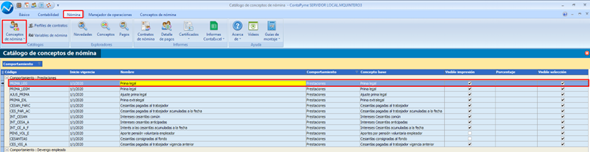
2. Establece su periodicidad como *semestral* y fechas en junio y diciembre.

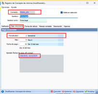
3. En la forma de cálculo, define fórmula tanto para cantidad como valor.

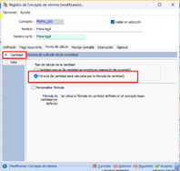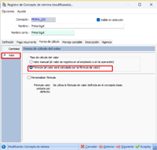

---

## ¿Cómo registro la novedad de prima en los contratos de los empleados?
**Respuesta:**
- Puedes parametrizarla en la pestaña *Prestaciones* del contrato.
- Si el concepto tiene periodicidad y fechas, el sistema la toma automáticamente al liquidar nómina.

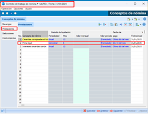
- También puedes generar una operación de novedad manual e ingresar el valor deseado (solo si el concepto está con cálculo *manual*).

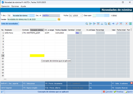

---

## ¿ContaPyme liquida automáticamente la prima o debo calcularla manualmente?
**Respuesta:**
- El sistema la liquida automáticamente si el concepto está formulado.
- Si necesitas controlar manualmente, puedes duplicar el concepto, marcarlo como *manual* y usarlo en operaciones puntuales.

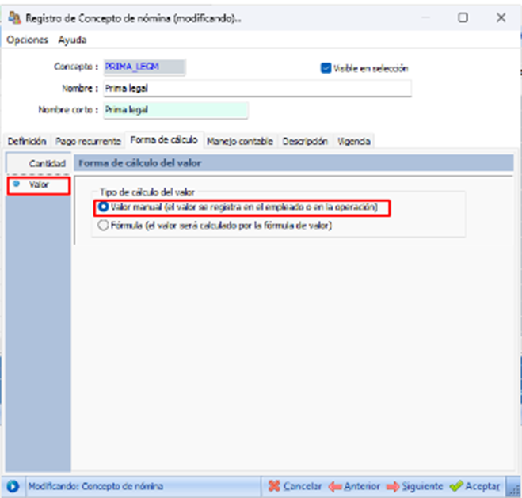

---

## ¿Dónde veo los valores acumulados para calcular la prima correctamente?
**Respuesta:**
- Usa el explorador de conceptos de nómina.

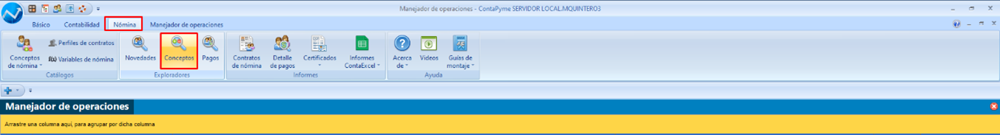
- Filtra por fechas, empleados y conceptos salariales.

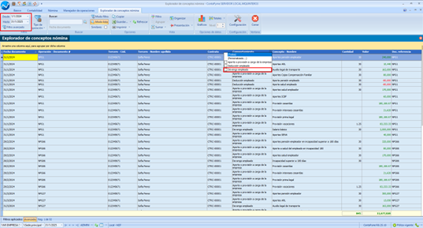

---

## ¿Qué hacer si un empleado ingresó o salió en el periodo de la prima?
**Respuesta:**
- El sistema calcula la prima proporcionalmente, basado en la fecha de ingreso o salida del contrato.

---

## ¿Cómo se contabiliza el pago de la prima en el sistema?
**Respuesta:**
- Se debita la cuenta configurada en el concepto de prima.
- La contrapartida se acredita según la forma de pago del empleado.

---

## ¿Se puede pagar la prima con la operación de nómina normal?
**Respuesta:**
Sí. La operación de pago de nómina ya incluye las prestaciones si están parametrizadas correctamente.

---

## ¿Cómo puedo generar el comprobante de pago de prima?
**Respuesta:**
1. Abre la operación de pago de nómina.
2. Pulsa `Ctrl+Y` para imprimir el comprobante.

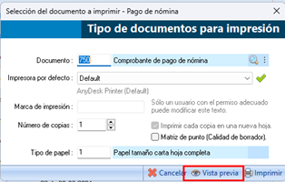
3. Puedes exportarlo a PDF.

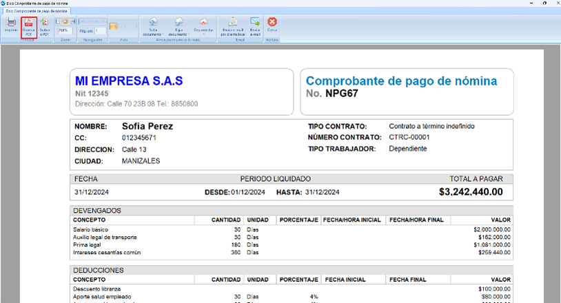

---

## El cálculo de la prima no me coincide, ¿qué puedo revisar?
**Respuesta:**
- Valida si el empleado tuvo ausencias injustificadas o pagos variables (horas extra, bonificaciones).
- Usa el informe de conceptos de nómina para filtrar por conceptos salariales.

---

## ¿Es posible pagar solo la prima en la planilla?
**Respuesta:**
Sí. Al digitar fechas, el sistema permite seleccionar solo *prestaciones*.

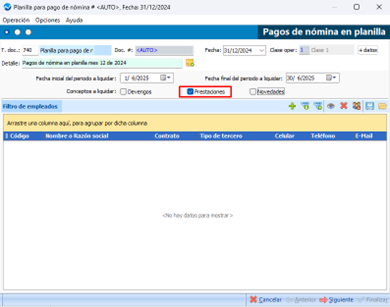

---

## ¿Qué consideraciones hay para Nómina Plus?
**Respuesta:**
La configuración es igual a Nómina Lite. Solo asegúrate de que los conceptos y empleados estén correctamente parametrizados.

---

## Casos especiales

### ¿Cómo calcular la prima para un empleado tiempo parcial o cotizante 51?
**Respuesta:**
- Verifica el periodo contratado.
- El sistema calculará proporcionalmente a los días laborados.

---

### ¿Cómo calcular la prima con salario variable?
**Respuesta:**
1. Marca el salario como *variable* en el contrato.
2. Usa el explorador de conceptos y selecciona los conceptos salariales (bonificaciones, horas extra, etc.).
3. Aplica fórmula:  
   **(Promedio conceptos salariales / 180) * 30 + Aux transporte (si aplica)**  
   Multiplicado por *(días laborados / 360)*

---

### ¿Cómo calcular la prima cuando hay comisiones, horas extras o recargos?
**Respuesta:**
- El sistema promedia estos conceptos y los suma al salario base para el cálculo de la prima.
- Aplica la fórmula mencionada arriba.

---

### ¿Cómo calcular la prima si el empleado tiene licencias no remuneradas o ausencias injustificadas?
**Respuesta:**
- El sistema descuenta los días de ausencia injustificada del cálculo.
- En caso de licencias no remuneradas, estos días no se tienen en cuenta para la prestación.

---
