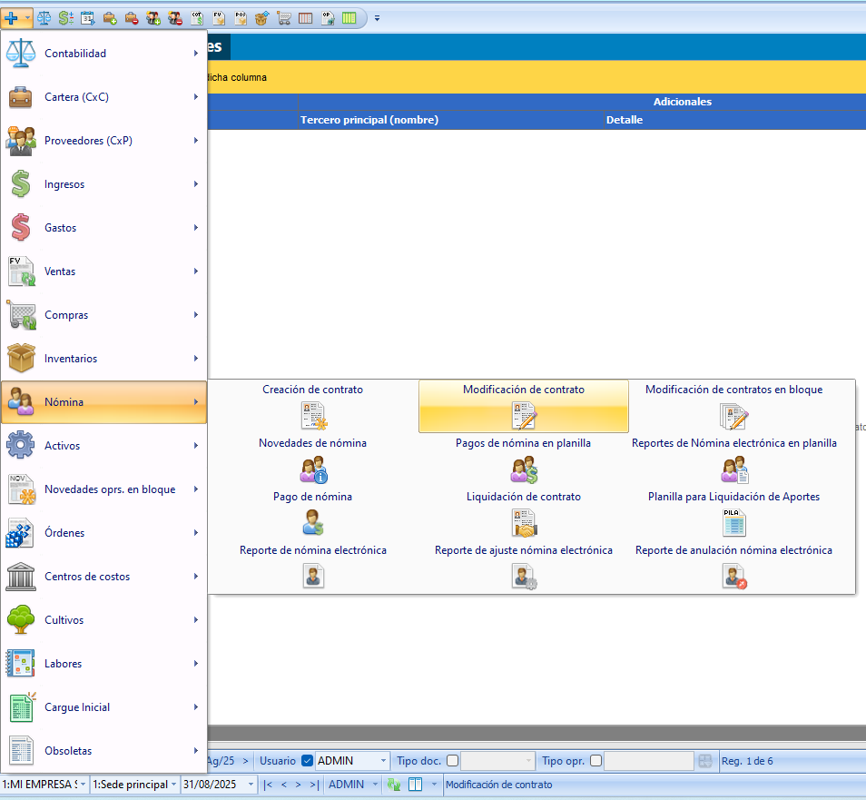
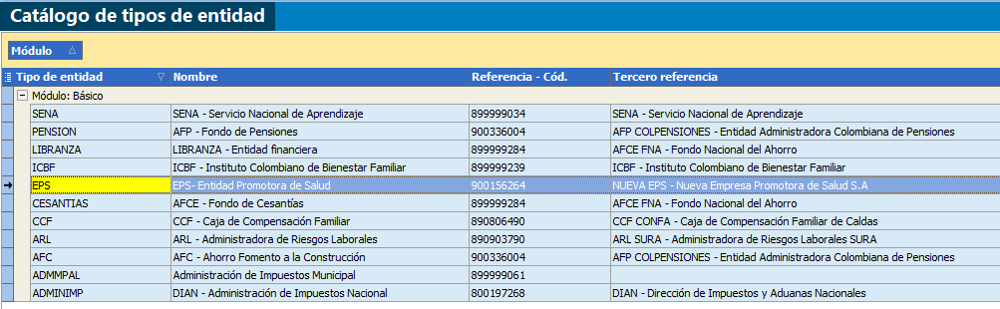
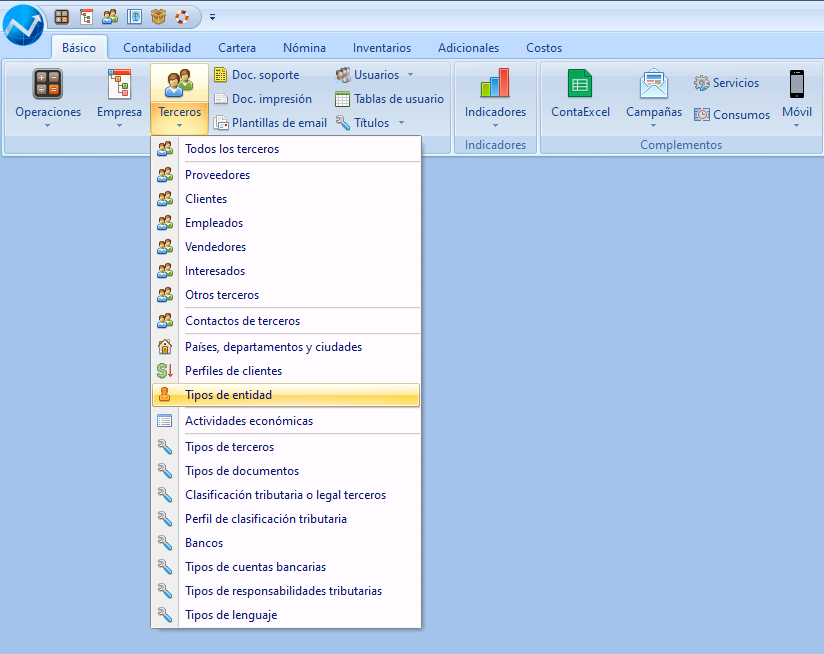
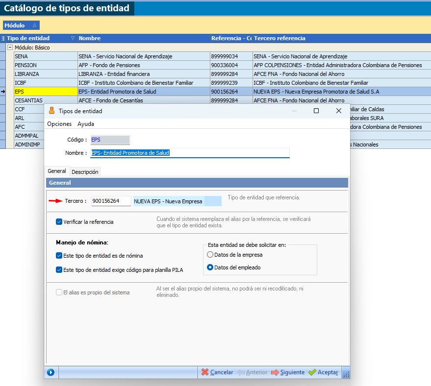
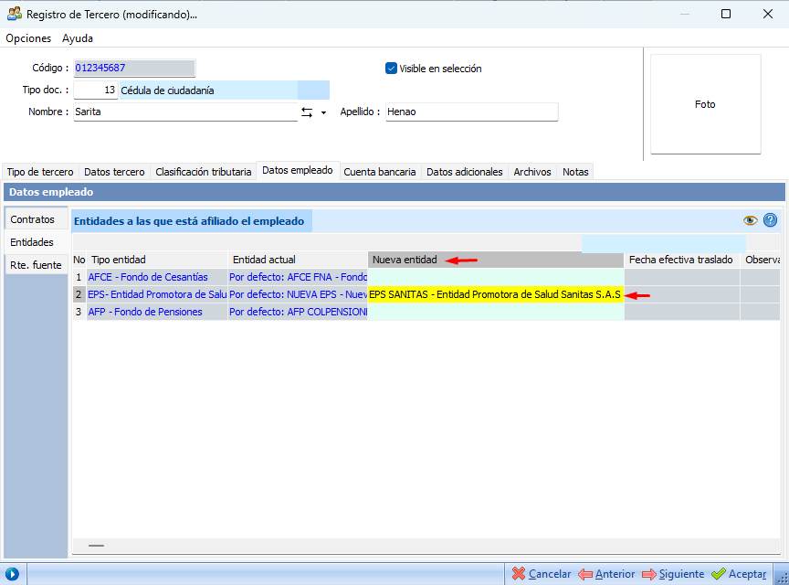

# Nómina

## Contratos y empleados

### ¿Cómo se modifica el salario de un empleado en el contrato?

**Respuesta:**  
En el módulo de nómina tienes una operación llamada **Modificar contrato**, que te permite hacer cambios en el contrato de un empleado, como fechas, centro de trabajo, tipo de salario (fijo, variable o integral), tipo de trabajador y, por supuesto, el salario.

1. Ingresa al **Manejador de Operaciones** y dale clic al botón **+** en el grupo de nómina. Ahí vas a encontrar la opción **Modificación de contrato individual** (si es solo para un empleado) o **en bloque** (si necesitas cambiar el salario a varios empleados al tiempo).

     
 
2. Ejemplo: Si Juan Pérez tenía un salario de $1.200.000 y lo actualizas a $1.400.000, ese nuevo valor se tendrá en cuenta en la próxima liquidación.

3. Ten en cuenta que este cambio impacta aportes, retenciones, provisiones, reportes electrónicos, y es importante que informes a contabilidad para mantener todo actualizado.

Para que tengas toda la información, puedes consultar los [videos de Modificación de contrato individual o en bloque](https://www.contapyme.com/capacitacion-virtual/#/CP40MOD680), donde te explicamos cómo hacerlo paso a paso.

**Recursos adicionales:**  
- [+Info: Modificar contrato](https://link-mas-info)  
- [Video: Modificación individual](https://www.youtube.com/watch?v=yTJdtTL586o&t=4s)  
- [Video: Modificación en bloque](https://www.youtube.com/watch?v=xNBtkDaBrrk&t=1s)  
- [Guía de montaje: Contratos](https://link-guia)

---

### ¿Cómo corregir una fecha mal registrada en el contrato?

**Respuesta:**  
En el módulo de nómina tienes la operación de **Modificar contrato**, que te permite corregir fechas mal registradas en el contrato, como la fecha de ingreso, fecha de retiro (si aplica) o fecha de modificación.

1. Ingresa al **Manejador de Operaciones** y dale clic al botón **+** en el grupo de nómina. Selecciona **Modificación de contrato individual** (para un solo empleado) o **en bloque** (para varios empleados).

     

2. Ejemplo: Si a María Gómez le registraste mal la fecha de ingreso como 01/03/2025 en vez de 01/02/2025, puedes entrar, corregirla y guardar. Así, en la próxima liquidación ya quedará con la fecha correcta.

3. Recuerda que cambiar fechas puede afectar antigüedad, provisiones, vacaciones, seguridad social y reportes. Es importante que informes a contabilidad si es un cambio relevante.

Para orientarte mejor, revisa los [videos de Modificación de contrato individual o en bloque](https://www.contapyme.com/capacitacion-virtual/#/CP40MOD680), donde te mostramos los pasos detallados.

**Recursos adicionales:**  
- [+Info: Corregir fecha contrato](https://link-mas-info)  
- [Video: Modificación individual](https://www.youtube.com/watch?v=yTJdtTL586o&t=4s)  
- [Video: Modificación en bloque](https://www.youtube.com/watch?v=xNBtkDaBrrk&t=1s)  
- [Guía de montaje: Contratos](https://link-guia)

---

## Entidades de nómina y proveedores de nómina

### ¿Qué es una entidad de nómina y para qué sirve?

**Respuesta:**  
En el sistema, una entidad de nómina es una categoría general que clasifica los diferentes tipos de aportes y pagos derivados de la nómina.

Estas entidades agrupan conceptos como:
- EPS (salud)  
- Fondo de pensión  
- ARL (riesgos laborales)  
- Caja de compensación  
- ICBF  
- SENA  
- Fondo de cesantías, entre otros

Es importante tener claro que la entidad de nómina no es la empresa a la que le pagas directamente, sino el tipo de obligación.  
Por ejemplo, el sistema sabe que debe calcular un aporte para EPS, pero no sabe a cuál EPS específica hasta que le indiques el proveedor.

  
*Imagen: Vista del catálogo donde se muestran las entidades de nómina clasificadas (EPS, pensión, ARL, etc.).*

**¿Y qué son los proveedores de nómina?**  
En el sistema, los proveedores de nómina son las empresas específicas que reciben esos aportes.

Ejemplo práctico:
- Entidad ➡ EPS / Proveedor ➡ Sanitas, Sura, Salud Total  
- Entidad ➡ Fondo de pensión / Proveedor ➡ Colpensiones, Protección, Porvenir  
- Entidad ➡ ARL / Proveedor ➡ Sura, Colpatria

Es decir, la entidad define qué tipo de aporte es, y el proveedor define a qué empresa se le paga ese aporte.

**¿Para qué sirve esta clasificación?**  
- Garantiza que los cálculos de nómina se hagan correctamente según cada tipo de aporte  
- Permite generar las cuentas por pagar a cada proveedor  
- Ayuda a organizar reportes electrónicos y soportes contables  
- Permite configurar un proveedor por defecto para cada entidad, o personalizarlo por empleado si tiene un proveedor distinto al general

Para que lo tengas más claro, revisa el [video de entidades de nómina](https://www.youtube.com/watch?v=rQAt8neSby0&t=5s), donde te mostramos cómo configurarlas en el sistema.

**Recursos adicionales:**  
- [Video: Entidades de nómina](https://www.youtube.com/watch?v=rQAt8neSby0&t=5s)  
- [Video: Proveedores de nómina](https://www.youtube.com/watch?v=snLC7eIEkKg)  
- [+Info: Entidades de nómina](https://link-mas-info)  
- [Guía de montaje: Entidades de nómina](https://link-guia)

---

### ¿Cuál es la diferencia entre un proveedor de nómina y una entidad de nómina?

**Respuesta:**  
El **tipo de entidad** de nómina define para qué es (EPS, pensión, ARL, etc.), mientras que el **proveedor de nómina** es la empresa específica.

Ejemplo práctico:  
- Tipo de entidad ➡ EPS  
- Proveedor ➡ Sanitas, Salud Total, Sura...  
- Tipo de entidad ➡ Fondo de pensión  
- Proveedor ➡ Colpensiones, Protección, Porvenir

La entidad es la categoría general, y el proveedor es a quién específicamente le pagas.

Para completar tus conocimientos, te recomendamos ingresar a la [plataforma de capacitación de nómina](https://www.contapyme.com/capacitacion-virtual/#/CP40MOD680), en la sesión PILA, donde encontrarás los tutoriales sobre **Proveedores de nómina**, **Catálogo de tipos de entidades** y **Cómo realizar traslados entre entidades de nómina**.

**Recursos adicionales:**  
- [Video: Entidades de nómina](https://www.youtube.com/watch?v=rQAt8neSby0&t=5s)  
- [Video: Proveedores de nómina](https://www.youtube.com/watch?v=snLC7eIEkKg)  
- [Video: ¿Cómo realizar traslados entre entidades de nómina?](https://www.youtube.com/watch?v=p6VxSfzSOO0) 
- [Plataforma de capacitación: Nómina - sesión PILA](https://www.contapyme.com/capacitacion-virtual/#/CP40MOD680)
---

### ¿Cómo configuro un tipo de entidad?

**Respuesta:**  
En el sistema, configurar correctamente los tipos de entidad y sus proveedores es fundamental para que los aportes de nómina queden bien calculados, se generen las cuentas por pagar correctamente y se construya el archivo para PILA de forma adecuada.

Primero defines **qué tipo de entidad es** (EPS, pensión, ARL, etc.), y luego asocias el **proveedor**, que es la empresa específica a la que le vas a pagar.

1. Ingresa al **Menu: Catálogo de terceros > Entidades de nómina**.  
     
   *Imagen: Pantalla del catálogo mostrando las entidades clasificadas por EPS, pensión, ARL, SENA, ICBF, entre otras.*

2. Configura un **proveedor de nómina por defecto** para cada entidad.  
   Esto sirve para que, al generar los pagos, el sistema cree automáticamente las cuentas por pagar a ese proveedor general y asocie correctamente los datos en el archivo para PILA.

     
   *Imagen: Pantalla donde seleccionas el proveedor predeterminado para cada entidad.*

   ✅ Ejemplo: Si la mayoría de tus empleados están afiliados a Nueva EPS, lo recomendable es configurar Salud Total como proveedor por defecto para la entidad EPS.

3. Personaliza proveedores específicos para empleados que lo necesiten:  
   - Ve a **Catálogo de terceros > Modificar empleado > Pestaña Entidades**.  
   - En la entidad correspondiente (como EPS), selecciona el proveedor específico solo para ese empleado.  
   Así, el sistema no usará el proveedor general, sino el que personalizaste para ese caso particular.

      
   *Imagen: Pantalla donde seleccionas el proveedor para cada empleado.*

👉 **Importante:** Esta personalización es clave para garantizar que, al generar el archivo para PILA, cada aporte quede asociado al proveedor correcto y evites rechazos o errores al cargarlo.

Para completar tus conocimientos, te recomendamos ingresar a la [plataforma de capacitación de nómina](https://www.contapyme.com/capacitacion-virtual/#/CP40MOD680), en la sesión PILA, donde encontrarás los tutoriales sobre **Proveedores de nómina**, **Catálogo de tipos de entidades** y **Cómo realizar traslados entre entidades de nómina**.

**Recursos adicionales:**  
- [Video: Entidades de nómina](https://www.youtube.com/watch?v=rQAt8neSby0&t=5s)  
- [Video: Proveedores de nómina](https://www.youtube.com/watch?v=snLC7eIEkKg)  
- [Video: ¿Cómo realizar traslados entre entidades de nómina?](https://www.youtube.com/watch?v=p6VxSfzSOO0) 
- [Plataforma de capacitación: Nómina - sesión PILA](https://www.contapyme.com/capacitacion-virtual/#/CP40MOD680)
